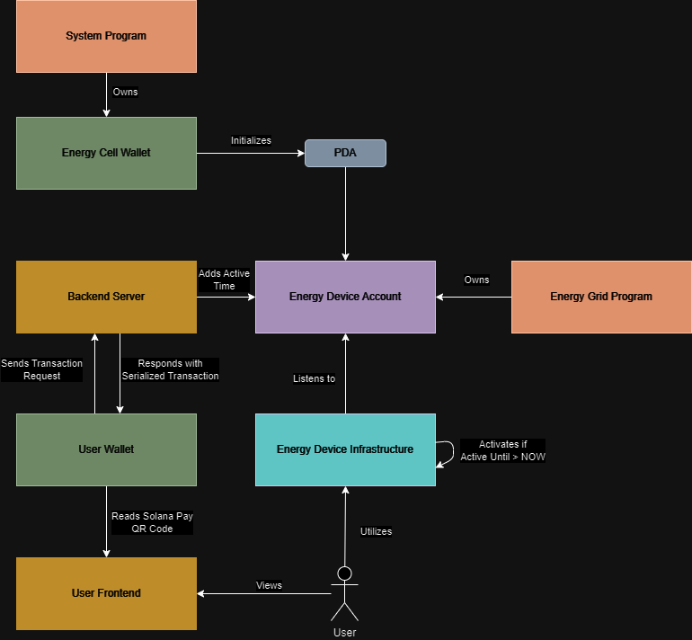
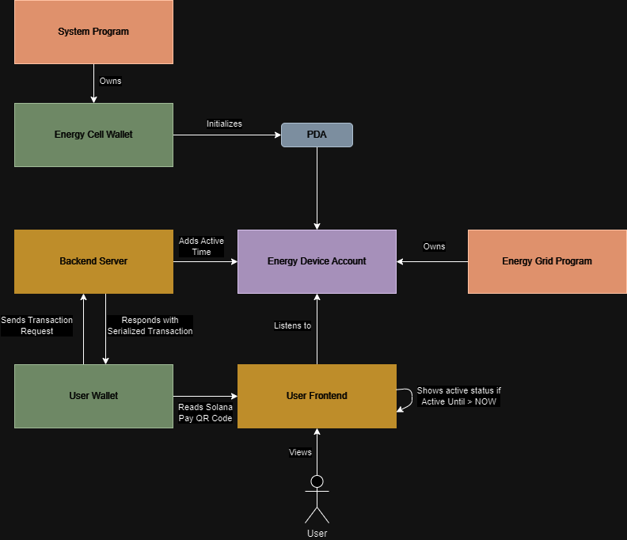

# Decentralized Energy Grid Simulation
This is a DePIN project in the Solana Blockchain that simulates a network where multiple virtual energy assets are registered, allowing users to rent these devices with blockchain transactions.

- [Decentralized Energy Grid Simulation](#decentralized-energy-grid-simulation)
  - [Architecture](#architecture)
    - [Real World Scenario](#real-world-scenario)
    - [Simulation](#simulation)
  - [Technologies](#technologies)
  - [Features](#features)
  - [Getting Started](#getting-started)
    - [Prerequisites](#prerequisites)
    - [Installing](#installing)
  - [Setup](#setup)
    - [Environment](#environment)
    - [Development (devnet)](#development-devnet)
    - [Production (mainnet)](#production-mainnet)
  - [Running Tests](#running-tests)
  - [Work-in-progress](#work-in-progress)
  - [Authors](#authors)
  - [License](#license)

## Architecture
### Real World Scenario
This diagram illustrates how the components would communicate in a real-world scenario, with a real energy device, such as a charging point.



### Simulation
This diagram illustrates how the components communicate in the simulation present in this project.



## Technologies
- Solana
- Solana Pay
- Rust (Smart Contract)
- Anchor
- TypeScript
- Next.js

## Features
- **Register your energy device**: By registering your energy device into the network, is it possible to securely rent it for your users.
- **Rent the energy device to other users**: Let users pay for using your device for a given amount of time by using Solana Pay!

## Getting Started
This step describes the prerequisites and install steps for the libraries needed to build and run the project.

### Prerequisites
- [Node.js 20+](https://nodejs.org/en)
- [Yarn](https://yarnpkg.com/getting-started/install)
- [Rust](https://www.rust-lang.org/tools/install)
- [Anchor](https://www.anchor-lang.com/docs/installation)

### Installing
First of all, you must clone this repository:
```sh
git clone https://github.com/andrewlod/decentralized-energy-grid-simulation.git
```

Then install all dependencies:
```sh
cd decentralized-energy-grid-simulation
# Install Node.js dependencies
yarn install
# Install Cargo dependencies and build the Rust project
anchor build
```

## Setup
### Environment
The Next.js app uses environment variables on both the non-production and the production environments. In order to setup the environment variables, create a `.env` file in the `app/energy-grid` directory. You can use the following template as a starting point:
```env
# Backend
NODE_ENV=development

ICON_URL=https://example.com/example.svg
ICON_LABEL=My Transaction
HOURLY_PRICE=0.0005
MERCHANT_SECRET_KEY=<paste your JSON private key here> # WARNING: THIS IS SENSITIVE DATA

ENERGY_DEVICE_NAME=test
CONNECTION_URL=https://api.devnet.solana.com

# Frontend
NEXT_PUBLIC_CONNECTION_URL=https://api.devnet.solana.com
NEXT_PUBLIC_MERCHANT_ADDRESS=<paste the merchant public key here>
NEXT_PUBLIC_ENERGY_DEVICE_NAME=test # Same as ENERGY_DEVICE_NAME
```

### Development (devnet)
In order to build and deploy the application in your development environment with the Solana devnet, run the following commands:
```sh
# Generate the binary on-chain program
anchor build
# Deploy the program to the devnet
anchor deploy --provider.cluster devnet
```

Then run the Next.js app. Make sure to use an HTTPS connection as Solana Pay only accepts HTTPS endpoints. If you are using localhost, you may use tools such as [ngrok](https://ngrok.com) to allow your application to be available in an HTTPS endpoint.
```sh
# Start Next.js app
cd app/energy-grid
yarn dev -H 0.0.0.0
# In another terminal, expose your port to ngrok
ngrok http 3000
```

Then access the endpoint shown on the ngrok window to test the app.

### Production (mainnet)
In order to build and deploy the application in your development environment with the Solana mainnet, run the following commands:
```sh
# Generate the binary on-chain program
anchor build
# Deploy the program to the mainnet
anchor deploy --provider.cluster mainnet
```

Then, deploy the backend server according to your needs. An example of a backend/frontend server is located in the `/app` folder.

## Running Tests
In order to build and test the application in your development environment with a Solana localnet, run the following commands:
```sh
# Generate the binary on-chain program
anchor build
# Run TypeScript tests
anchor test
```

## Work-in-progress
This section describes features that are either work-in-progress or will be implemented in the future. Features are sorted by priority.
- 🚧: Work-in-progress
- ❌: Not yet started

| Feature | Status |
|---------|--------|
|Allow energy device simulation owner to customize their energy device features|❌|
|Allow energy device simulation owner to rent their energy device for custom periods|❌|
|Create GitHub Workflows for testing and linting the smart contract|❌|
|Publish simulation app on Vercel|❌|
|Record demo of functioning project|❌|

## Authors
- Andre Wlodkovski - [@andrewlod](https://github.com/andrewlod)

## License
This project is licensed under the [MIT License](https://opensource.org/license/mit) - see the [LICENSE](LICENSE) file for details.